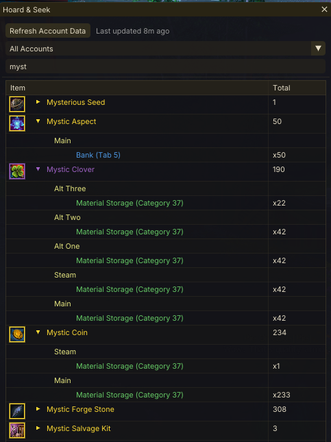
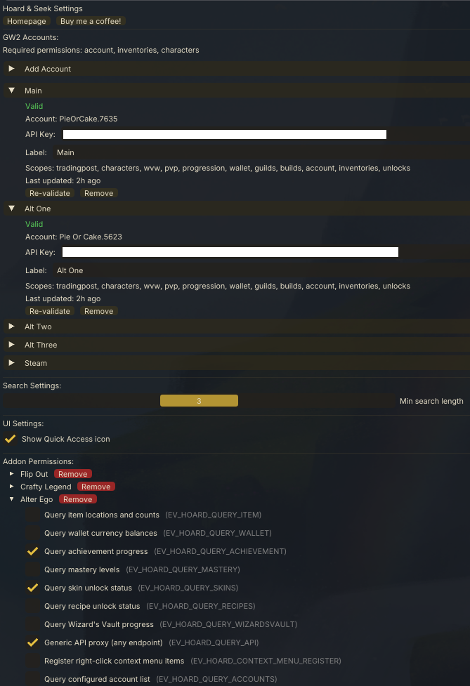
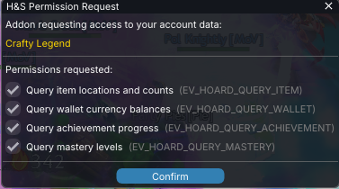

# Hoard & Seek

A Guild Wars 2 addon for [Raidcore Nexus](https://raidcore.gg/Nexus) that lets you search for items across your entire account — bank, material storage, shared inventory, character bags, and equipped gear.

## AI Notice

This addon has been 100% created in [Windsurf](https://windsurf.com/) using Claude. I understand that some folks have a moral, financial or political objection to creating software using an LLM. I just wanted to make a useful tool for the GW2 community, and this was the only way I could do it.

If an LLM creating software upsets you, then perhaps this repo isn't for you. Move on, and enjoy your day.

## Features

- **Multi-account support** — configure up to 16 GW2 accounts with custom labels
- **Account-wide item search** — type an item name and instantly see where it is
- **Location tracking** — shows exact location: bank tab, material storage, character name + bag number, equipped slot, shared inventory, guild stash, or TP delivery box
- **Wallet & currency search** — search wallet currencies alongside items
- **Persistent cache** — account data is saved locally so searches work across game sessions
- **Cross-addon API** — other addons can query item counts, wallet balances, achievements, masteries, skin/recipe unlocks, and Wizard's Vault progress via Nexus events
- **Generic API proxy** — other addons can query any authenticated GW2 API endpoint through H&S
- **Context menu hooks** — other addons can register custom right-click menu items on search results
- **Permission system** — users control which addons can access their account data

## Screenshots





<details>
<summary><h2>GW2 API Endpoints Used</h2></summary>

| Endpoint | Purpose |
|---|---|
| `/v2/account/materials` | Material storage contents |
| `/v2/account/bank` | Bank vault contents (with tab tracking) |
| `/v2/account/inventory` | Shared inventory slots |
| `/v2/characters` | Character list |
| `/v2/characters/:name/inventory` | Character bag contents |
| `/v2/characters/:name/equipment` | Equipped gear per character |
| `/v2/account/legendaryarmory` | Legendary armory contents |
| `/v2/account` | Account name, guild IDs |
| `/v2/guild/:id` | Guild name |
| `/v2/guild/:id/stash` | Guild bank contents (per tab) |
| `/v2/commerce/delivery` | Trading Post delivery box |
| `/v2/account/wallet` | Wallet currency balances |
| `/v2/currencies?ids=...` | Currency names and details |
| `/v2/items?ids=...` | Item names, icons, rarity, type |
| `/v2/tokeninfo` | API key validation |
| `/v2/account/achievements?ids=...` | Achievement progress (proxy query) |
| `/v2/account/masteries` | Mastery levels (proxy query) |
| `/v2/account/skins` | Skin unlock status (proxy query) |
| `/v2/account/recipes` | Recipe unlock status (proxy query) |
| `/v2/account/wizardsvault/daily` | Wizard's Vault daily objectives (proxy query) |
| `/v2/account/wizardsvault/weekly` | Wizard's Vault weekly objectives (proxy query) |
| `/v2/account/wizardsvault/special` | Wizard's Vault special objectives (proxy query) |

### Required API Key Permissions

- `account`
- `inventories`
- `characters`
- `unlocks`
- `guilds` (optional — enables guild stash search)
- `tradingpost` (optional — enables TP delivery box search)
- `progression` (optional — enables Wizard's Vault proxy queries)

</details>

## Building

### Prerequisites

- CMake 3.20+
- MinGW cross-compiler (`x86_64-w64-mingw32-gcc`, `x86_64-w64-mingw32-g++`)

### Setup

Download dependencies (ImGui and nlohmann/json):

```bash
chmod +x scripts/setup.sh
./scripts/setup.sh
```

### Build

```bash
mkdir build && cd build
cmake ..
make
```

This produces `HoardAndSeek.dll`.

## Installation

1. Install [Raidcore Nexus](https://raidcore.gg/Nexus) for Guild Wars 2
2. Copy `HoardAndSeek.dll` to your Nexus addons directory
3. Launch GW2 — toggle the search window with `Ctrl+Shift+F` or click the icon in the Quick Access toolbar

## Usage

1. Open Nexus addon settings and expand the **Add Account** section
2. Create a GW2 API key at [account.arena.net](https://account.arena.net/applications) and paste it in
3. Optionally enter a label (e.g. "Main", "Alt") for easy identification
4. Click **Add & Validate** — the key will be validated automatically
5. Repeat for additional accounts (up to 16)
6. Open the Hoard & Seek window (`Ctrl+Shift+F`)
7. Click **Refresh Account Data** to fetch all account data
8. Type at least 3 characters in the search box to find items

When multiple accounts are configured, search results are grouped by account using your labels. Use the account filter dropdown to narrow results to a single account.

## Cross-Addon API

Hoard & Seek exposes a Nexus event-based API so other addons can query item counts, wallet balances, achievements, masteries, skin/recipe unlocks, Wizard's Vault progress, and any authenticated GW2 API endpoint — without their own API key. It also supports context menu hooks, multi-account queries, and a permission system for user consent.

**No link-time dependency required** — just copy `include/HoardAndSeekAPI.h` into your addon and communicate via Nexus events.

👉 **[Full API Reference](API.md)** — events, request/response patterns, threading caveats, permissions, multi-account support, and code examples.

For LLM-assisted integration, see **[INTEGRATION_PROMPT.md](INTEGRATION_PROMPT.md)** — a step-by-step guide designed to be pasted into an AI coding assistant.

<details>
<summary><h2>Project Structure</h2></summary>

```
hoard_and_seek/
├── CMakeLists.txt              # Build configuration
├── HoardAndSeek.def            # DLL export definition
├── API.md                      # Full cross-addon API reference
├── INTEGRATION_PROMPT.md       # LLM integration guide for addon developers
├── screenshots/                # Screenshots for documentation
├── include/
│   ├── HoardAndSeekAPI.h       # Cross-addon event API (include in your addon)
│   └── nexus/
│       └── Nexus.h             # Raidcore Nexus API header
├── src/
│   ├── dllmain.cpp             # Addon entry point, ImGui UI, keybinds, event handlers
│   ├── GW2API.h                # GW2 API interface (location-aware item tracking)
│   ├── GW2API.cpp              # GW2 API implementation (HTTP, caching, search)
│   ├── IconManager.h           # Async icon download and texture management
│   ├── IconManager.cpp         # Icon download worker, disk cache, Nexus texture loading
│   ├── PermissionManager.h     # Per-addon permission checking and UI
│   └── PermissionManager.cpp   # Permission persistence, popup, and settings panel
├── scripts/
│   └── setup.sh                # Dependency download script
└── README.md
```

</details>

## License

This project is licensed under the [MIT License](LICENSE).

## Third-Party Notices

This project uses the following open-source libraries:

- **[Dear ImGui](https://github.com/ocornut/imgui)** — MIT License, Copyright (c) 2014-2021 Omar Cornut
- **[nlohmann/json](https://github.com/nlohmann/json)** — MIT License, Copyright (c) 2013-2025 Niels Lohmann
- **[Nexus API](https://raidcore.gg/Nexus)** — MIT License, Copyright (c) Raidcore.GG
